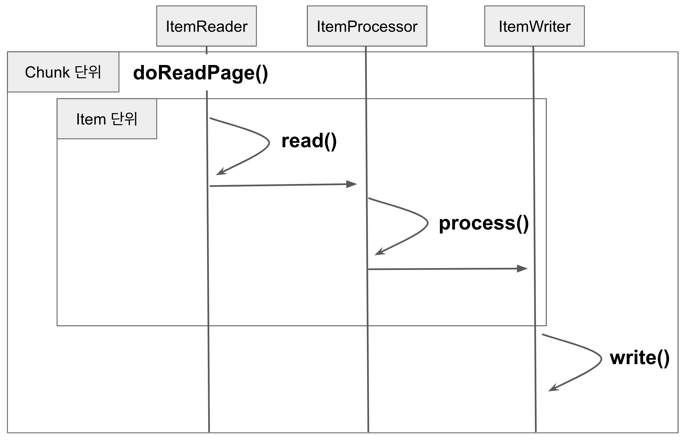
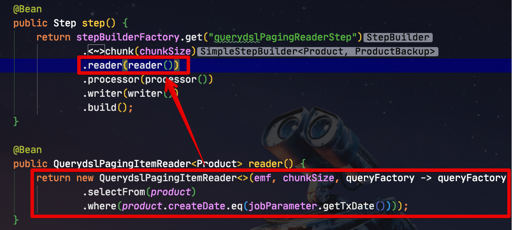
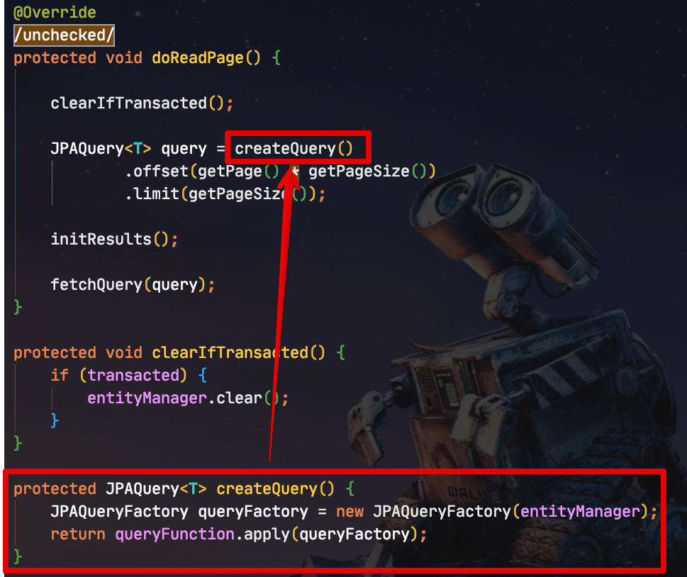
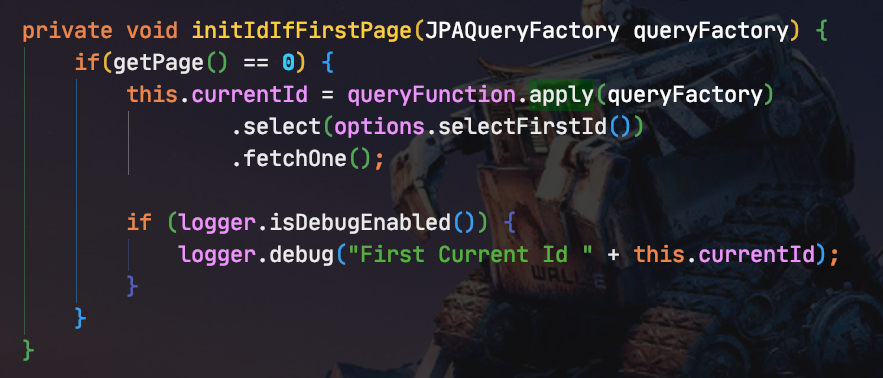

# Spring Batch와 QuerydslItemReader

> 예제로 사용한 모든 코드는 [Github](https://github.com/jojoldu/spring-batch-querydsl)에 올려두었습니다.

현재 팀에서 공식적으로 JPA를 사용하면서 **복잡한 조회 쿼리**는 [Querydsl](http://www.querydsl.com/) 로 계속 처리해오고 있었습니다.  
  
웹 애플리케이션에서는 크게 문제가 없으나, 배치 애플리케이션에서는 문제가 하나 있었습니다.  
  
그건 바로 Spring Batch 프레임워크에서 공식적으로 **QuerydslItemReader를 지원하지 않는 것**이였습니다.  
  
아래는 Spring Batch에서 공식적으로 지원하는 ItemReader들의 목록입니다.

| Reader                    |
|---------------------------|
| JdbcCursorItemReader      |
| JdbcPagingItemReader      |
| HibernateCursorItemReader |
| HibernatePagingItemReader |
| JpaPagingItemReader       |
| RepositoryItemReader      |

이외에도 [다양한 ItemReader](https://docs.spring.io/spring-batch/docs/current/reference/html/appendix.html#itemReadersAppendix)들을 지원하지만 **QuerydslItemReader는 지원하지 않습니다**.

> 참고로 IbatisItemReader도 지원이 중단되었습니다.  
> MyBatis 진영에서 직접 [MyBatisPagingItemReader](http://mybatis.org/spring/batch.html) 를 만들어 지원하고 있습니다.

이러다보니 Spring Batch에서 Querydsl를 사용하기가 쉽지 않았는데요.  
  
큰 변경 없이 Spring Batch에 Querydsl ItemReader를 사용한다면 다음과 같이 **AbstractPagingItemReader를 상속한 ItemReader** 생성해야만 했습니다.

```java
public class ProductRepositoryItemReader extends AbstractPagingItemReader<Product> {
    private final ProductBatchRepository productBatchRepository;
    private final LocalDate txDate;

    public ProductRepositoryItemReader(ProductBatchRepository productBatchRepository,
                                      LocalDate txDate,
                                      int pageSize) {

        this.productBatchRepository = productBatchRepository;
        this.txDate = txDate;
        setPageSize(pageSize);
    }

    @Override // 직접 페이지 읽기 부분 구현
    protected void doReadPage() {
        if (results == null) {
            results = new ArrayList<>();
        } else {
            results.clear();
        }

        List<Product> products = productBatchRepository.findPageByCreateDate(txDate, getPageSize(), getPage());

        results.addAll(products);
    }

    @Override
    protected void doJumpToPage(int itemIndex) {
    }
}
```

당연히 이 ItemReader에서 사용할 **페이징 쿼리를 가진 Querydsl Repository**도 추가로 생성합니다.

```java
@Repository
public class ProductBatchRepository extends QuerydslRepositorySupport {
    private final JPAQueryFactory queryFactory;

    public ProductBatchRepository(JPAQueryFactory queryFactory) {
        super(Product.class);
        this.queryFactory = queryFactory;
    }

    public List<Product> findPageByCreateDate(LocalDate txDate, int pageSize, long offset) {
        return queryFactory
                .selectFrom(product) // 실제 쿼리
                .where(product.createDate.eq(txDate)) // 실제 쿼리
                .limit(pageSize) // 페이징
                .offset(offset) // 페이징
                .fetch();
    }
}
```

위 코드를 **매 Batch Job마다 작성**해야만 했습니다.  
  
중요한 Querydsl의 쿼리 작성보다 **행사코드가 더 많은 일**이 발생한 것이죠.  
행사코드가 많다는 말은 **중요하지 않은 코드에 더 많은 시간을 써야할 수도** 있음을 이야기합니다.  
  
실제로 위의 Reader에서 변경이 필요한 부분은 **주어진 조건의 Product를 가져오는 쿼리**입니다.  
repository의 Querydsl 부분을 제외하고는 **대부분은 비슷한 코드가 필요합니다**.  
  
결과적으로 JpaPagingItemReader, HibernatePagingItemReader에 비해 Querydsl을 사용하는 방식은 불편한 점이 있다고 판단되었습니다.  

> 물론 Querdsl을 포기하고 JpaPagingItemReader를 이용해도 됩니다만, 그렇게 되면 Querydsl의 **타입 안정성, 자동완성, 컴파일 단계 문법체크, 공백이슈**를 지원받을 수가 없습니다.  
> 100개가 넘는 테이블, 수십개의 배치를 개발/운영하는 입장에서 이걸 포기할 순 없었습니다.
  
그래서 팀에서는 **Querydsl의 쿼리에만 집중**할 수 있도록  QuerydslPagingItemReader를 개발하게 되었습니다.  
  
이 글에서는 아래 2가지 ItemReader에 대해 소개하고 사용법을 다뤄볼 예정입니다.

* Querydsl**Paging**ItemReader
* Querydsl**NoOffset**PagingItemReader
  * MySQL의 offset 성능 이슈를 해결하기 위해 **offset없이 페이징**하는 QuerydslReader 입니다.

그럼 이제 시작하겠습니다.

> 주의: 이 글에서 나오는 코드는 직접 팀 내부에서 사용중이지만, **고려하지 못한 케이스가 있을 수 있습니다**.  
> 직접 코드를 보시고, **충분히 테스트를 거친 후에** 사용하시는걸 추천드립니다.

## 1. QuerydslPagingItemReader

Querydsl이 결과적으로 JPQL을 안전하게 표현할 수 있다는 점을 고려해본다면 QuerydslPagingItemReader의 컨셉은 단순합니다.  
  
**JpaPagingItemReader에서 JPQL이 수행되는 부분만 교체**하는 것 입니다.  
  
그렇다면 JpaPagingItemReader에서 JPQL이 수행되는 부분은 어디일까요?  
Spring Batch의 구조를 보면서 확인해보겠습니다.  
  
기본적으로 Spring Batch 의 Chunk 지향 구조 (reader/processor/writer) 는 아래와 같습니다.



* ```doReadPage()```
  * ```page``` (offset) 와 ```pageSize``` (limit) 을 이용해 데이터를 가져옵니다.
* ```read()```
  * ```doReadpage()``` 로 가져온 데이터들을 **하나씩 processor로 전달**합니다.
  * 만약 ```doReadpage()```로 가져온 데이터를 모두 processor에 전달했다면, **다음 페이지 데이터들을 가져오도록** ```doReadPage()```를 호출합니다.

여기서 **JPQL이 실행되는 부분**은 ```doReadPage()``` 입니다.  
즉, ```doReadPage()``` 에서 쿼리가 수행되는 부분을 Querydsl의 쿼리로 변경하면 되는것이죠.  


보시는것처럼 ```createQuery()```가 별도로 있어 그 부분만 override 하면 될 것 같지만, ```private``` 메소드라서 불가능합니다.


단순하게 JpaPagingItemReader를 상속하여 ```createQuery()```만 override를 할 수 없다는 것을 알게되었으니 **JpaPagingItemReader의 전체 코드를 복사**하여 생성하겠습니다.  

> 이 부분을 ```protected```로 변경해주면 참 좋겠는데 아쉽습니다.
  
복사한 JpaPagingItemReader를 코드로 QuerydslPagingItemReader 를 만들어보겠습니다.  


```java
import com.querydsl.jpa.impl.JPAQuery;
import com.querydsl.jpa.impl.JPAQueryFactory;
import org.springframework.batch.item.database.AbstractPagingItemReader;
import org.springframework.dao.DataAccessResourceFailureException;
import org.springframework.util.ClassUtils;
import org.springframework.util.CollectionUtils;

import javax.persistence.EntityManager;
import javax.persistence.EntityManagerFactory;
import java.util.HashMap;
import java.util.List;
import java.util.Map;
import java.util.concurrent.CopyOnWriteArrayList;
import java.util.function.Function;

public class QuerydslPagingItemReader<T> extends AbstractPagingItemReader<T> {

    protected final Map<String, Object> jpaPropertyMap = new HashMap<>();
    protected EntityManagerFactory entityManagerFactory;
    protected EntityManager entityManager;
    protected Function<JPAQueryFactory, JPAQuery<T>> queryFunction;
    protected boolean transacted = true;//default value

    protected QuerydslPagingItemReader() {
        setName(ClassUtils.getShortName(QuerydslPagingItemReader.class));
    }

    public QuerydslPagingItemReader(EntityManagerFactory entityManagerFactory,
                                    int pageSize,
                                    Function<JPAQueryFactory, JPAQuery<T>> queryFunction) {
        this();
        this.entityManagerFactory = entityManagerFactory;
        this.queryFunction = queryFunction;
        setPageSize(pageSize);
    }

    public void setTransacted(boolean transacted) {
        this.transacted = transacted;
    }

    @Override
    protected void doOpen() throws Exception {
        super.doOpen();

        entityManager = entityManagerFactory.createEntityManager(jpaPropertyMap);
        if (entityManager == null) {
            throw new DataAccessResourceFailureException("Unable to obtain an EntityManager");
        }
    }

    @Override
    @SuppressWarnings("unchecked")
    protected void doReadPage() {

        clearIfTransacted();

        JPAQuery<T> query = createQuery()
                .offset(getPage() * getPageSize())
                .limit(getPageSize());

        initResults();

        fetchQuery(query);
    }

    protected void clearIfTransacted() {
        if (transacted) {
            entityManager.clear();
        }
    }

    protected JPAQuery<T> createQuery() {
        JPAQueryFactory queryFactory = new JPAQueryFactory(entityManager);
        return queryFunction.apply(queryFactory);
    }

    protected void initResults() {
        if (CollectionUtils.isEmpty(results)) {
            results = new CopyOnWriteArrayList<>();
        } else {
            results.clear();
        }
    }

    protected void fetchQuery(JPAQuery<T> query) {
        if (!transacted) {
            List<T> queryResult = query.fetch();
            for (T entity : queryResult) {
                entityManager.detach(entity);
                results.add(entity);
            }
        } else {
            results.addAll(query.fetch());
        }
    }

    @Override
    protected void doJumpToPage(int itemIndex) {
    }

    @Override
    protected void doClose() throws Exception {
        entityManager.close();
        super.doClose();
    }
}
```

> 후술할 Querydsl**NoOffset**PagingItemReader에서 QuerydslPagingItemReader를 **상속**하기 때문에 대부분의 메소드와 필드는 ```protected``` 입니다.

대부분의 코드가 기존 JpaPagingItemReader에 있던 코드라 달라진 부분들만 보시면 될것 같습니다.  
  
먼저 **람다 표현식**을 사용할 수 있도록 ```Function<JPAQueryFactory, JPAQuery<T>> queryFunction``` 가 생성자 인자로 추가되었습니다.


Querydsl의 쿼리를 람다표현식으로 받도록 하여 **매번 새로운 Reader를 만들 필요 없이 Job 클래스에서 바로 Reader를 생성**할 수 있게 됩니다.



(사용 예시)  
  
기존의 JpaPagingItemReader, HibernatePagingItemReader 처럼 Job 클래스내부에서 사용할 수 있게 되었습니다.  
  
createQuery 메소드는 생성자 인자로 받은 ```queryFunction```을 사용해 Querydsl 쿼리를 생성합니다.



offset과 limit은 부모 클래스인 AbstractPagingItemReader 의 ```getPage()``` 와 ```getPageSize()```를 사용하여 최대한 변경 요소를 줄입니다.  
  
코드를 보시면 JpaPagingItemReader의 ```doReadPage()``` 에서 ```createQuery``` 외에 다른 부분이 있다는 것을 알 수 있으실텐데요.  
  
바로 ```EntityTransaction``` 부분입니다.


해당 부분을 QuerydslPagingItemReader에서 제거한 이유는 ```hibernate.default_batch_fetch_size```이 정상적으로 작동하지 않기 때문입니다.  

> hibernate.default_batch_fetch_size 옵션이 처음이시라면 어떤 옵션인지에 대한 내용은 [이전에 작성한 포스팅](https://jojoldu.tistory.com/457)을 참고해보세요. 

> 해당 옵션이 작동되지 않는 이유에 대해서는 [이전에 작성한 포스팅](https://jojoldu.tistory.com/414)을 참고해주세요.

대량의 데이터에서 주로 사용되는 배치 애플리케이션에서 JPA의 N+1 문제는 심각한 성능 저하를 일으키기 때문에 해당 부분을 제거했습니다.  
  
그럼 새롭게 만든 이 ItemReader가 제대로 작동하는지 테스트 코드로 검증해보겠습니다.

> 위 이슈에 대해서는 Spring Batch 팀에 [PR](https://github.com/spring-projects/spring-batch/pull/713)을 보낸 상황입니다.

### 1-1. 테스트코드로 검증

먼저 페이지 사이즈에 따라 데이터가 정상적으로 반환되는지 테스트 해보겠습니다.

> 전체 테스트 코드는 [Github](https://github.com/jojoldu/spring-batch-querydsl/tree/master/spring-batch-querydsl-integration-test/src/test/java/org/springframework/batch/item/querydsl/integrationtest)에 별도로 올라갔습니다.

```java
@Test
public void reader가_정상적으로_값을반환한다() throws Exception {
    //given
    LocalDate txDate = LocalDate.of(2020,10,12);
    String name = "a";
    int expected1 = 1000;
    int expected2 = 2000;
    productRepository.save(new Product(name, expected1, txDate));
    productRepository.save(new Product(name, expected2, txDate));

    int pageSize = 1; // (1)

    QuerydslPagingItemReader<Product> reader = new QuerydslPagingItemReader<>(emf, pageSize, queryFactory -> queryFactory
            .selectFrom(product)
            .where(product.createDate.eq(txDate)));

    reader.open(new ExecutionContext()); // (2)

    //when
    Product read1 = reader.read();
    Product read2 = reader.read();
    Product read3 = reader.read();

    //then
    assertThat(read1.getPrice()).isEqualTo(expected1);
    assertThat(read2.getPrice()).isEqualTo(expected2);
    assertThat(read3).isNull(); // (3)
}

```

(1) **페이징이 정상적으로 되는지** 확인하기 위해 pageSize를 1로 했습니다.

* 2개의 데이터를 넣었으니, 이렇게 하면 **총 3번의 페이징 쿼리가 발생**합니다.
* 2번이 아니라 3번인 이유는, 마지막 쿼리를 통해 **더이상 읽을것이 없는지** 확인하기 때문입니다.
  
(2) ItemReader만 단독으로 테스트 하기 위해서는 별도의 실행환경 (```ExecutionContext```)을 등록 해줘야만 합니다.

* ```open``` 메소드를 실행하지 않으면 ```EntityManager```를 등록하지 않습니다.

(3) ItemReader에서는 더이상 읽을 데이터가 없을 경우 ```read()```에서 ```null```을 반환합니다.

자 그럼 이 테스트 코드를 수행해보겠습니다.


```java
@Test
public void 빈값일경우_null이_반환된다() throws Exception {
    //given
    LocalDate txDate = LocalDate.of(2020,10,12);

    int pageSize = 1;

    QuerydslPagingItemReader<Product> reader = new QuerydslPagingItemReader<>(emf, pageSize, queryFactory -> queryFactory
            .selectFrom(product)
            .where(product.createDate.eq(txDate)));

    reader.open(new ExecutionContext());

    //when
    Product read1 = reader.read();

    //then
    assertThat(read1).isNull();
}
```

### 1-2. 사용 방법

이렇게 만든 QuerydslPagingItemReader는 아래와 같이 사용할 수 있습니다.

```java
@Slf4j
@RequiredArgsConstructor
@Configuration
public class QuerydslPagingItemReaderConfiguration {
    public static final String JOB_NAME = "querydslPagingReaderJob";

    private final JobBuilderFactory jobBuilderFactory;
    private final StepBuilderFactory stepBuilderFactory;
    private final EntityManagerFactory emf;
    private final QuerydslPagingItemReaderJobParameter jobParameter;

    private int chunkSize;

    @Value("${chunkSize:1000}")
    public void setChunkSize(int chunkSize) {
        this.chunkSize = chunkSize;
    }

    @Bean
    @JobScope
    public QuerydslPagingItemReaderJobParameter jobParameter() {
        return new QuerydslPagingItemReaderJobParameter();
    }

    @Bean
    public Job job() {
        return jobBuilderFactory.get(JOB_NAME)
                .start(step())
                .build();
    }

    @Bean
    public Step step() {
        return stepBuilderFactory.get("querydslPagingReaderStep")
                .<Product, ProductBackup>chunk(chunkSize)
                .reader(reader())
                .processor(processor())
                .writer(writer())
                .build();
    }

    @Bean
    public QuerydslPagingItemReader<Product> reader() {
        return new QuerydslPagingItemReader<>(emf, chunkSize, queryFactory -> queryFactory
                .selectFrom(product)
                .where(product.createDate.eq(jobParameter.getTxDate())));
    }

    private ItemProcessor<Product, ProductBackup> processor() {
        return ProductBackup::new;
    }

    @Bean
    public JpaItemWriter<ProductBackup> writer() {
        return new JpaItemWriterBuilder<ProductBackup>()
                .entityManagerFactory(emf)
                .build();
    }
}
```

> JPA의 Entity를 사용하는 Reader에서는 **chunkSize와 pageSize 값을 일치**시키시는게 좋습니다.  
> 관련해서는 이전에 [별도로 포스팅](https://jojoldu.tistory.com/146)한게 있으니 참고하시면 좋습니다.

해당 Job을 테스트코드로도 검증해봅니다.

```java
@RunWith(SpringRunner.class)
@SpringBootTest(classes = {TestBatchConfig.class, QuerydslPagingItemReaderConfiguration.class})
@SpringBatchTest
public class QuerydslPagingItemReaderConfigurationTest {
    public static final DateTimeFormatter FORMATTER = ofPattern("yyyy-MM-dd");

    @Autowired
    private ProductRepository productRepository;

    @Autowired
    private ProductBackupRepository productBackupRepository;

    @Autowired
    private JobLauncherTestUtils jobLauncherTestUtils;

    @After
    public void after() throws Exception {
        productRepository.deleteAllInBatch();
        productBackupRepository.deleteAllInBatch();
    }

    @Test
    public void Product가_ProductBackup으로_이관된다() throws Exception {
        //given
        LocalDate txDate = LocalDate.of(2020,10,12);
        String name = "a";
        int expected1 = 1000;
        int expected2 = 2000;
        productRepository.save(new Product(name, expected1, txDate));
        productRepository.save(new Product(name, expected2, txDate));

        JobParameters jobParameters = new JobParametersBuilder()
                .addString("txDate", txDate.format(FORMATTER))
                .toJobParameters();

        //when
        JobExecution jobExecution = jobLauncherTestUtils.launchJob(jobParameters);

        //then
        assertThat(jobExecution.getStatus()).isEqualTo(BatchStatus.COMPLETED);
        List<ProductBackup> backups = productBackupRepository.findAll();
        assertThat(backups.size()).isEqualTo(2);
    }
}
```

## 2. QuerydslNoOffsetPagingItemReader

많은 분들이 이미 아시겠지만, MySQL 은 특성상 **페이징이 뒤로 갈수록 느려집니다**.  
  
즉, 아래와 같은 형태의 쿼리는 **offset 값이 커질수록 느리다**는 의미입니다.

```sql
SELECT  *
FROM  items
WHERE  조건문
ORDER BY id DESC
OFFSET 페이지번호
LIMIT 페이지사이즈
```

위 쿼리는 일반적으로 **Batch에서 ItemReader 가 수행하는 쿼리와 유사한 형태**입니다.  

이 문제를 해결하기 위해서는 크게 2가지 해결책이 있습니다.

### 1) 서브쿼리 + Join 으로 해결하기

먼저 아래와 같이 서브쿼리 + Join으로 해결하는 방식이 있습니다.

```sql
SELECT  *
FROM  items as i
JOIN (SELECT id
        FROM items
        WHERE 조건문
        ORDER BY id DESC
        OFFSET 페이지번호
        LIMIT 페이지사이즈) as temp on temp.id = i.id
```

많은 부하가 필요한 ```order by```, ```offset```은 클러스터 인덱스인 ```id```로 진행하고, 그 결과로 나온 id 값들 (```limit``` 만큼 조회된 결과) 을 통해 다른 필요한  필드들은 실제로 해당 행에 접근해서 가져오는 방식을 이야기 합니다.

> 참고: https://elky84.github.io/2018/10/05/mysql/

### 2) offset을 제거한 페이징쿼리 사용하기

두번째는 **이전에 조회된 결과를 한번에 건너뛸수 있게** 마지막 조회결과의 ID를 조건문에 사용하는 것입니다.

```sql
SELECT  *
FROM items
WHERE 조건문 AND id < 마지막조회ID
ORDER BY id DESC
LIMIT 페이지사이즈
```

offset 페이징 쿼리가 뒤로갈수록 느린 이유는 결국 **앞에서 읽었던 행을 다시 읽어야하기 때문**인데요.  
  
예를 들어 ```limit 10000, 20``` 이라 하면 10,020개의 행을 읽어야 합니다.  
그리고 이 중 앞의 10,000 개 행을 버리는 과정이 들어갑니다.  
  
뒤로갈수록 읽어야할 행의 개수가 많기 때문에 갈수록 느려지는 것입니다.  
  
두번째 방식은 바로 이 부분에서 **읽기를 시작해야할 부분을 정해줍니다**.  
이는 데이터베이스가 **이전 페이지의 행을 건너 뛸 수 있음**을 의미합니다.  
  
즉, 아무리 페이지가 뒤로 가더라도 **처음 페이지를 읽은것과 동일한 효과**를 가지게 됩니다. 

> 참고: [fetch-next-page](https://use-the-index-luke.com/sql/partial-results/fetch-next-page)


2가지 방식 모두 성능 향상을 기대할 순 있으나 이번에 만들 PagingItemReader는 2번째 방법을 사용합니다.
그 이유는 다음과 같습니다.

* 첫 번째 방식 역시 뒤로 갈수록 느려지는 현상은 발생합니다.
  * 당연히 기존 방식에 비해서는 훨씬 성능이 좋습니다.
* **JPQL 에서는 from절의 서브쿼리를 지원하지 않습니다**.
  * 이게 가장 큰 이유였습니다.

그래서 두번째 방식을 선택하게 되었습니다.  
  
두번째 방식을 선택하면서 몇가지 고려 사항이 있었습니다만 다행히 현재 저희 프로젝트에서는 그 부분들이 모두 문제가 되지않아 **별도의 PagingItemReader**를 만들 수 있었습니다.
  
* 모든 Entity는 pk가 **Long 타입, 컬럼명과 필드명 모두 id**로 통일
  * 왜 이게 필요한지는 이후 구현부에서 자세히 설명드리겠습니다.
* 대부분의 Batch Job들이 ```order by```가 **필수가 아님**
  * 각 raw 데이터를 읽어와 집계 / 변환하는 Batch들이 대부분이였습니다.
  * ```order by```가 **pk외에 다른 기준으로 복잡하게** 사용해야 한다면 미리 만들어둔 PagingItemReader를 활용하기는 어렵습니다.

QuerydslNoOffsetPagingItemReader 가 기존의 QuerydslPagingItemReader에 비해 추가되어야 할 점은 다음과 같습니다.

* 조회된 페이지의 **마지막 id 값을 캐시**
* 캐시된 **마지막 id값을 다음 페이지 쿼리 조건문**에 추가
* **정렬 기준에 따라** 마지막 id를 이용한 조회 조건이 변경되어야 한다
  * ```order by id asc```: ```id > 마지막 id```
  * ```order by id desc```: ```id < 마지막 id```


전체 코드는 아래와 같습니다.

```java
import com.querydsl.jpa.impl.JPAQuery;
import com.querydsl.jpa.impl.JPAQueryFactory;
import org.springframework.util.ClassUtils;
import org.springframework.util.CollectionUtils;

import javax.persistence.EntityManagerFactory;
import java.util.function.Function;

public class QuerydslNoOffsetPagingItemReader<T extends BaseEntityId> extends QuerydslPagingItemReader<T> {

    private Long currentId = 0L;
    private QuerydslNoOffsetOptions options;

    private QuerydslNoOffsetPagingItemReader() {
        super();
        setName(ClassUtils.getShortName(QuerydslNoOffsetPagingItemReader.class));
    }

    public QuerydslNoOffsetPagingItemReader(EntityManagerFactory entityManagerFactory,
                                            int pageSize,
                                            QuerydslNoOffsetOptions options,
                                            Function<JPAQueryFactory, JPAQuery<T>> queryFunction) {
        this();
        super.entityManagerFactory = entityManagerFactory;
        super.queryFunction = queryFunction;
        this.options = options;
        setPageSize(pageSize);
    }

    @Override
    @SuppressWarnings("unchecked")
    protected void doReadPage() {

        clearIfTransacted();

        JPAQuery<T> query = createQuery().limit(getPageSize());

        initResults();

        fetchQuery(query);

        resetCurrentId();
    }

    @Override
    protected JPAQuery<T> createQuery() {
        JPAQueryFactory queryFactory = new JPAQueryFactory(entityManager);

        initIdIfFirstPage(queryFactory);

        if(this.currentId == null) {
            return queryFunction.apply(queryFactory);
        }

        return queryFunction.apply(queryFactory)
                .where(options.whereExpression(currentId))
                .orderBy(options.orderExpression());
    }

    private void initIdIfFirstPage(JPAQueryFactory queryFactory) {
        if(getPage() == 0) {
            this.currentId = queryFunction.apply(queryFactory)
                    .select(options.selectFirstId())
                    .fetchOne();

            if (logger.isDebugEnabled()) {
                logger.debug("First Current Id " + this.currentId);
            }
        }
    }

    private void resetCurrentId() {
        if (!CollectionUtils.isEmpty(results)) {
            currentId = results.get(results.size() - 1).getId();

            if (logger.isDebugEnabled()) {
                logger.debug("Current Id " + currentId);
            }
        }
    }
}
```

여기서 위에서 얘기한 조건 외에 한가지가 더 추가 되었는데요.  
바로 ```initIdIfFirstPage()``` 입니다.



해당 메소드는 다음과 같은 역할을 합니다.  
**첫번째 페이지 조회시 max()/min() 을 이용해 가장 첫번째 기준 ID를 가져옵니다**.  
  
이 메소드가 추가된 이유는 2가지 문제를 회피하기 위함인데요.

* 첫번째 페이지 조회시에도 정렬기준을 넣게 되면 클러스터 인덱스를 기준으로 **전체 정렬이 발생**하여 큰 성능 저하가 발생합니다.
  * 두번째 페이지부터는 id 조건문이 추가되어 빠릅니다.
* 첫번째 페이지 호출시에는 정렬 기준을 제외한다면 **진짜 첫 페이지인지 확신할 수 없습니다**.
  * 정렬 기준이 없기 때문에 ```order by id```가 추가되었을때와 다를수 있습니다. 

첫번째 ID값을 가져오는 것에 대한 성능 이슈는 생각보다 크지 않았습니다.  
별도로 디스크를 읽어오는 작업 없이 id의 최대값/최소값을 가져오기 때문에 아주 빠른 속도로 가져옵니다.  

  

```java
public interface BaseEntityId {
    Long getId();
}
```


* 오름차순: ```>```
* 내림차순: ```<```

```java
public class QuerydslNoOffsetOptions {
    private final NumberPath<Long> id;
    private final Expression expression;

    public QuerydslNoOffsetOptions(@Nonnull NumberPath<Long> id, @Nonnull Expression expression) {
        this.id = id;
        this.expression = expression;
    }

    public NumberExpression<Long> selectFirstId() {
        if (expression.isAsc()) {
            return id.min().add(-1);
        }

        return id.max().add(1);
    }

    public BooleanExpression whereExpression(Long compare) {
        if (expression.isAsc()) {
            return id.gt(compare);
        }

        return id.lt(compare);
    }

    public OrderSpecifier<Long> orderExpression() {
        if (expression.isAsc()) {
            return id.asc();
        }

        return id.desc();
    }

    public enum Expression {
        ASC(WhereExpression.GT, OrderExpression.ASC),
        DESC(WhereExpression.LT, OrderExpression.DESC);

        private final WhereExpression where;
        private final OrderExpression order;

        Expression(WhereExpression where, OrderExpression order) {
            this.where = where;
            this.order = order;
        }

        public boolean isAsc() {
            return this == ASC;
        }
    }

    public enum WhereExpression {
        GT, LT;
    }

    public enum OrderExpression {
        ASC, DESC;
    }
}
```


> 당연한 이야기지만, 위와 같이 ```id``` 필드&컬럼을 사용하는 것외에 다른 방식이 필요하다면 **글의 서두에서 언급**했던 ```Repository```를 주입받아 사용하시면 됩니다.

### 2-1. 테스트코드로 검증

### 2-2. 사용 방법

## 3. QuerydslNoOffsetPagingItemReader 성능 비교

> 꼭 QuerydslNoOffsetPagingItemReader를 썼다기보다는, Offset을 제거한 방식이면 뭐든지 해당되겠습니다.

### 3-1. 첫번째 Batch Job

|                                  | 총 수행 시간 | 마지막 페이지 읽기 시간 |
|----------------------------------|--------------|-------------------------|
| QuerydslPagingItemReader         | 21분         | 2.4초                   |
| QuerydslNoOffsetPagingItemReader | 4분 36초     | 0.03초                  |


### 3-2. 두번째 Batch Job

|                                  | 총 수행 시간 | 마지막 페이지 읽기 시간 |
|----------------------------------|--------------|-------------------------|
| QuerydslPagingItemReader         | 55분         | 5초                     |
| QuerydslNoOffsetPagingItemReader | 2분 27초     | 0.8초                   |


