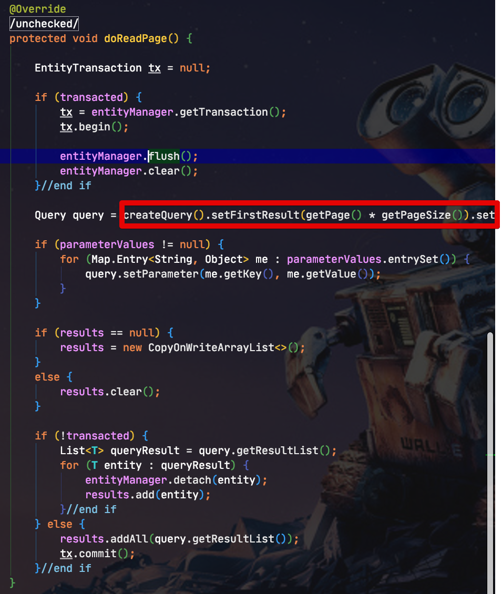
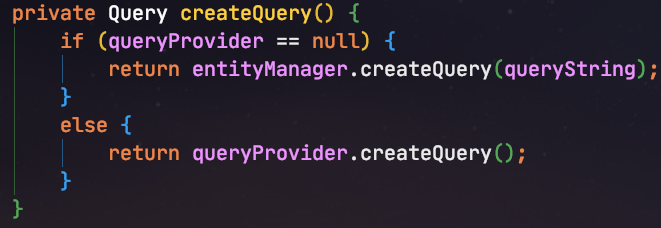
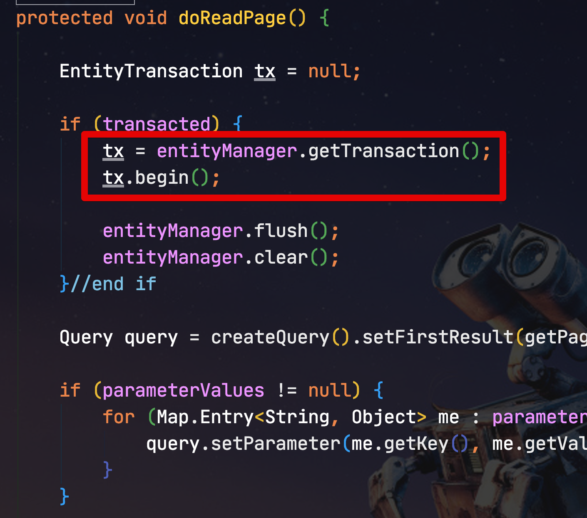
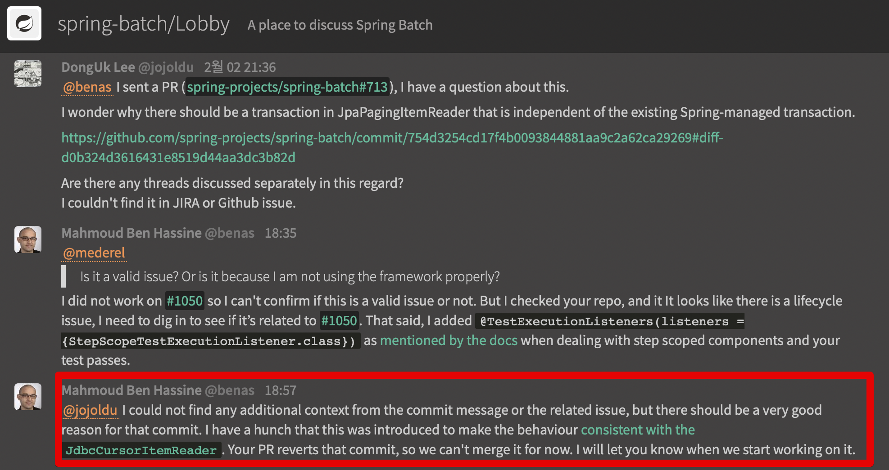
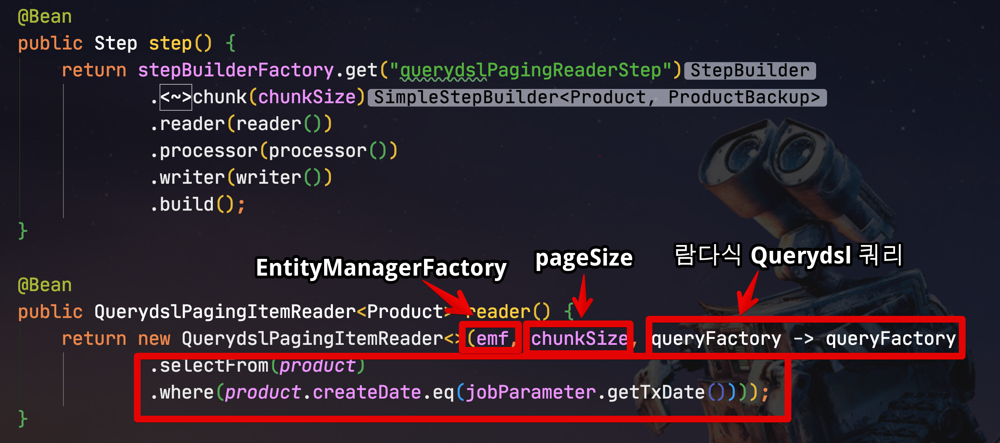
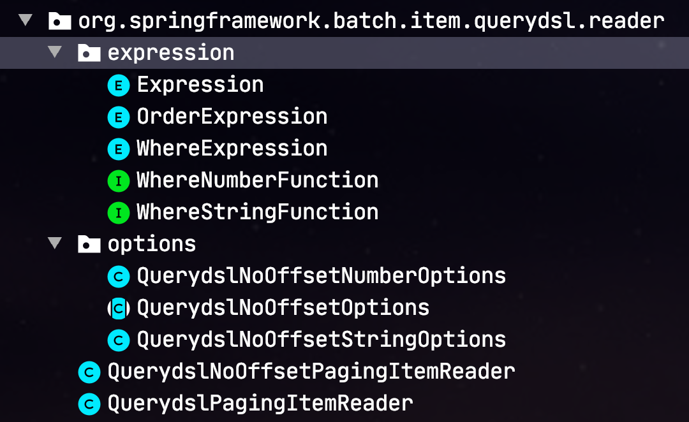
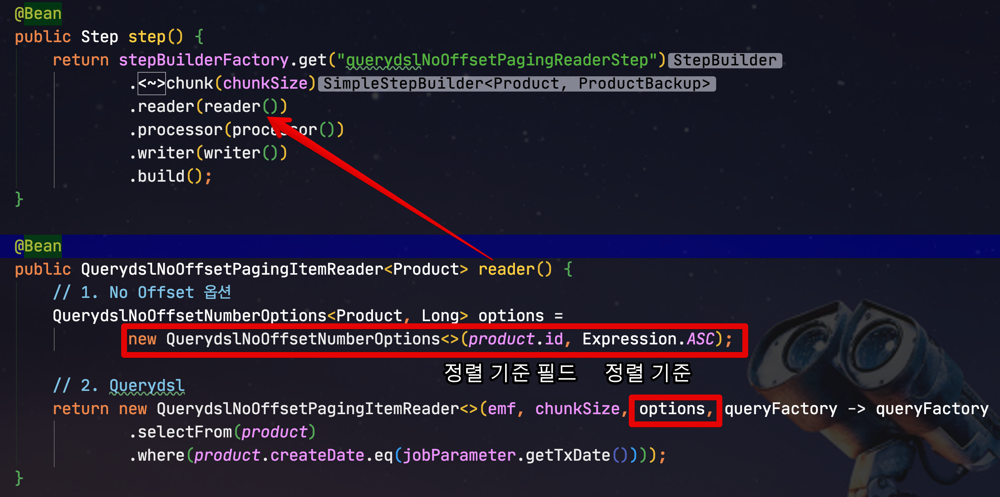

# Spring Batch와 QuerydslItemReader

안녕하세요 우아한 형제들 정산시스템팀 이동욱입니다.  
  
올해는 무슨 글을 기술 블로그에 쓸까 고민하다가, 1월초까지 생각했던 주제는 **팀에 관련된 주제**였습니다.  
  
[결팀소: 결제시스템팀을 소개합니다](http://woowabros.github.io/woowabros/2019/08/06/wooteamso.html)와 같은 "정팀소-정산시스템팀을 소개합니다" 혹은 "정개추-정산에서개발을추구하면안되는걸까" (던만추 컨셉) 등이였죠.  


(던만추)  
  
팀에 관련된 이야기라면 뭐니뭐니해도 팀장님 얘기가 빠질수가 없는데, 주제를 정하자마자 **조직개편으로 팀장님이 다른 팀으로 발령**났습니다.  
  
정권이 교체되었으니 라인 환승도 해야하고, [우아한테크코스](http://woowabros.github.io/techcourse/2019/10/14/woowacourse.html) 졸업생 분이 신입 개발자로 합류도 하셔서 팀 이야기는 좀 더 뒤로 미룰수 밖에 없었습니다.


(레진코믹스의 [레바툰-191화](https://www.lezhin.com/ko/comic/revatoon/191))  
  
그래서 비 기술적인 주제 보다는 시류를 덜타는 기술적인 주제를 찾게 되었는데요.  
저희팀이 유독 많이 사용하고, 필요하면 라이브러리를 만들어서 사용하기도 하는 **Spring Batch와 Querydsl**에 대해 주제를 정하게 되었습니다.  
  
아무래도 Spring Batch는 다른 스프링 모듈에 비해 인기가 없는데요.  
Mvc나 Data, Security 등과 관련되서 쓰면 좀 더 많은 분들이 볼것 같은데 라는 생각도 들었습니다.  
  
하지만 이미 본문을 먼저 다쓰고 서문을 쓰고 있어서 어쩔수 없습니다.  
트래픽으로 증명할 수 밖에요.  
이 글을 보고 계신분들 힘을 모아주세요.

## Intro

> 예제로 사용한 모든 코드는 [Github](https://github.com/jojoldu/spring-batch-querydsl)에 올려두었습니다.

현재 팀에서 공식적으로 JPA를 사용하면서 **복잡한 조회 쿼리**는 [Querydsl](http://www.querydsl.com/) 로 계속 처리해오고 있었습니다.  
  
웹 애플리케이션에서는 크게 문제가 없으나, 배치 애플리케이션에서는 문제가 하나 있었습니다.  
  
그건 바로 Spring Batch 프레임워크에서 공식적으로 **QuerydslItemReader를 지원하지 않는 것**이였습니다.  
  
아래는 Spring Batch에서 공식적으로 지원하는 ItemReader들의 목록입니다.

| Reader                    |
|---------------------------|
| JdbcCursorItemReader      |
| JdbcPagingItemReader      |
| HibernateCursorItemReader |
| HibernatePagingItemReader |
| JpaPagingItemReader       |
| RepositoryItemReader      |

이외에도 [다양한 ItemReader](https://docs.spring.io/spring-batch/docs/current/reference/html/appendix.html#itemReadersAppendix)들을 지원하지만 **QuerydslItemReader는 지원하지 않습니다**.

> IbatisItemReader도 지원이 중단되었습니다.  
> MyBatis 진영에서 직접 [MyBatisPagingItemReader](http://mybatis.org/spring/batch.html) 를 만들어 지원하고 있으니 참고해보세요.

이러다보니 Spring Batch에서 Querydsl를 사용하기가 쉽지 않았는데요.  
  
큰 변경 없이 Spring Batch에 Querydsl ItemReader를 사용한다면 다음과 같이 **AbstractPagingItemReader를 상속한 ItemReader** 생성해야만 했습니다.

```java
public class ProductRepositoryItemReader extends AbstractPagingItemReader<Product> {
    private final ProductBatchRepository productBatchRepository;
    private final LocalDate txDate;

    public ProductRepositoryItemReader(ProductBatchRepository productBatchRepository,
                                      LocalDate txDate,
                                      int pageSize) {

        this.productBatchRepository = productBatchRepository;
        this.txDate = txDate;
        setPageSize(pageSize);
    }

    @Override // 직접 페이지 읽기 부분 구현
    protected void doReadPage() {
        if (results == null) {
            results = new ArrayList<>();
        } else {
            results.clear();
        }

        List<Product> products = productBatchRepository.findPageByCreateDate(txDate, getPageSize(), getPage());

        results.addAll(products);
    }

    @Override
    protected void doJumpToPage(int itemIndex) {
    }
}
```

당연히 이 ItemReader에서 사용할 **페이징 쿼리를 가진 Querydsl Repository**도 추가로 생성합니다.

```java
@Repository
public class ProductBatchRepository extends QuerydslRepositorySupport {
    private final JPAQueryFactory queryFactory;

    public ProductBatchRepository(JPAQueryFactory queryFactory) {
        super(Product.class);
        this.queryFactory = queryFactory;
    }

    public List<Product> findPageByCreateDate(LocalDate txDate, int pageSize, long offset) {
        return queryFactory
                .selectFrom(product) // 실제 쿼리
                .where(product.createDate.eq(txDate)) // 실제 쿼리
                .limit(pageSize) // 페이징
                .offset(offset) // 페이징
                .fetch();
    }
}
```

위 코드를 **매 Batch Job마다 작성**해야만 했습니다.  
그리고 신규 입사자가 올때마다 ```AbstractPagingItemReader``` 를 어떻게 상속 받아 구현체를 만들어야 하는지 설명해야만 했습니다.  
JpaPagingItemReader나 HibernatePagingItemReader를 사용한다면 쿼리만 작성하면 되는 일인데 말이죠.  
  
정작 중요한 배치 쿼리 작성보다 **행사 코드가 더 많은 일**이 발생한 것입니다.  
행사코드가 많다는 말은 **중요하지 않은 코드에 더 많은 시간을 써야함**을 이야기합니다.  
  
실제로 위의 Reader에서 변경이 필요한 부분은 **주어진 조건의 Product를 가져오는 쿼리**입니다.  
그 외 나머지 부분은 매번 Reader가 필요할때마다 작성해야할 반복된 코드입니다.  
(```offset```, ```limit```, 생성자, ```results.addAll(products);``` 등등)  
  
결과적으로 JpaPagingItemReader, HibernatePagingItemReader에 비해 Querydsl을 사용하는 방식은 불편한 점이 많았습니다.  

> 물론 Querdsl을 포기하고 JpaPagingItemReader를 이용해도 됩니다만, 그렇게 되면 Querydsl의 **타입 안정성, 자동완성, 컴파일 단계 문법체크, 공백 이슈 대응**를 지원받을 수가 없습니다.  
> 더군다나 페이징 성능 향상을 위한 Offset이 제거된 페이징 처리는 JpaPagingItemReader에서도 불가능하여 매번 별도의 Reader를 만들수 밖에 없었습니다.  
> 100개가 넘는 테이블, 수십개의 배치를 개발/운영하는 입장에서 이걸 포기할 순 없었습니다.  
  
그래서 팀에서는 **Querydsl의 쿼리에만 집중**할 수 있도록  QuerydslItemReader를 개발하게 되었습니다.  
  
이 글에서는 아래 2가지 ItemReader에 대해 소개하고 사용법을 다뤄볼 예정입니다.

* Querydsl**Paging**ItemReader
* Querydsl**NoOffsetPaging**ItemReader
  * MySQL의 offset 성능 이슈를 해결하기 위해 **offset없이 페이징**하는 QuerydslItemReader 입니다.

그럼 이제 시작하겠습니다.

> 주의: 이 글에서 나오는 코드는 직접 팀 내부에서 사용중이지만, **고려하지 못한 케이스가 있을 수 있습니다**.  
> 직접 코드를 보시고, **충분히 테스트를 거친 후에** 사용하시는걸 추천드립니다.  
> 아래 모든 코드는 스프링부트 2.1.3 ~ 2.2.4 까지만 검증되었습니다.  
> 이외 다른 버전에 대해서는 테스트 하지 못했으니 참고해주세요.

## 1. QuerydslPagingItemReader

Querydsl이 결과적으로 JPQL을 안전하게 표현할 수 있다는 점을 고려해본다면 QuerydslPagingItemReader의 컨셉은 단순합니다.  
  
**JpaPagingItemReader에서 JPQL이 수행되는 부분만 교체**하는 것 입니다.  
  
그렇다면 JpaPagingItemReader에서 JPQL이 수행되는 부분은 어디일까요?  
Spring Batch의 구조를 보면서 확인해보겠습니다.  
  
기본적으로 Spring Batch 의 Chunk 지향 구조 (reader/processor/writer) 는 아래와 같습니다.


* ```doReadPage()```
  * ```page``` (offset) 와 ```pageSize``` (limit) 을 이용해 데이터를 가져옵니다.
* ```read()```
  * ```doReadPage()``` 로 가져온 데이터들을 **하나씩 processor로 전달**합니다.
  * 만약 ```doReadPage()```로 가져온 데이터를 모두 processor에 전달했다면, **다음 페이지 데이터들을 가져오도록** ```doReadPage()```를 호출합니다.

여기서 **JPQL이 실행되는 부분**은 ```doReadPage()``` 입니다.  
즉, ```doReadPage()``` 에서 쿼리가 수행되는 부분을 Querydsl의 쿼리로 변경하면 되는것이죠.  



보시는것처럼 ```createQuery()```가 별도로 있어 그 부분만 override 하면 될 것 같지만, ```private``` 메소드라서 불가능합니다.



단순하게 JpaPagingItemReader를 상속하여 ```createQuery()```만 override를 할 수 없다는 것을 알게되었으니 **JpaPagingItemReader의 전체 코드를 복사**하여 생성하겠습니다.  

> 이 부분을 ```protected```로 변경해주면 참 좋겠는데 아쉽습니다.
  
복사한 JpaPagingItemReader를 코드로 QuerydslPagingItemReader 를 만들어보겠습니다.  


```java
public class QuerydslPagingItemReader<T> extends AbstractPagingItemReader<T> {

    protected final Map<String, Object> jpaPropertyMap = new HashMap<>();
    protected EntityManagerFactory entityManagerFactory;
    protected EntityManager entityManager;
    protected Function<JPAQueryFactory, JPAQuery<T>> queryFunction;
    protected boolean transacted = true;//default value

    protected QuerydslPagingItemReader() {
        setName(ClassUtils.getShortName(QuerydslPagingItemReader.class));
    }

    public QuerydslPagingItemReader(EntityManagerFactory entityManagerFactory,
                                    int pageSize,
                                    Function<JPAQueryFactory, JPAQuery<T>> queryFunction) {
        this();
        this.entityManagerFactory = entityManagerFactory;
        this.queryFunction = queryFunction;
        setPageSize(pageSize);
    }

    public void setTransacted(boolean transacted) {
        this.transacted = transacted;
    }

    @Override
    protected void doOpen() throws Exception {
        super.doOpen();

        entityManager = entityManagerFactory.createEntityManager(jpaPropertyMap);
        if (entityManager == null) {
            throw new DataAccessResourceFailureException("Unable to obtain an EntityManager");
        }
    }

    @Override
    @SuppressWarnings("unchecked")
    protected void doReadPage() {

        clearIfTransacted();

        JPAQuery<T> query = createQuery()
                .offset(getPage() * getPageSize())
                .limit(getPageSize());

        initResults();

        fetchQuery(query);
    }

    protected void clearIfTransacted() {
        if (transacted) {
            entityManager.clear();
        }
    }

    protected JPAQuery<T> createQuery() {
        JPAQueryFactory queryFactory = new JPAQueryFactory(entityManager);
        return queryFunction.apply(queryFactory);
    }

    protected void initResults() {
        if (CollectionUtils.isEmpty(results)) {
            results = new CopyOnWriteArrayList<>();
        } else {
            results.clear();
        }
    }

    protected void fetchQuery(JPAQuery<T> query) {
        if (!transacted) {
            List<T> queryResult = query.fetch();
            for (T entity : queryResult) {
                entityManager.detach(entity);
                results.add(entity);
            }
        } else {
            results.addAll(query.fetch());
        }
    }

    @Override
    protected void doJumpToPage(int itemIndex) {
    }

    @Override
    protected void doClose() throws Exception {
        entityManager.close();
        super.doClose();
    }
}
```

> 후술할 Querydsl**NoOffsetPaging**ItemReader에서 QuerydslPagingItemReader를 **상속**하기 때문에 대부분의 메소드와 필드는 ```protected```를 사용했습니다.

대부분의 코드가 기존 JpaPagingItemReader에 있던 코드라서 달라진 부분들만 보시면 될 것 같습니다.  
  
먼저 **람다 표현식**을 사용할 수 있도록 ```Function<JPAQueryFactory, JPAQuery<T>> queryFunction``` 가 생성자 인자로 추가되었습니다.


Querydsl의 쿼리를 람다표현식으로 받도록 하여 **매번 새로운 Reader를 만들 필요 없이** Job 클래스에서 바로 Reader를 생성할 수 있게 됩니다.


(사용 예시)  
  
기존의 JpaPagingItemReader, HibernatePagingItemReader 처럼 Job 클래스내부에서 사용할 수 있게 되었습니다.  
  
createQuery 메소드는 생성자 인자로 받은 ```queryFunction```을 사용해 Querydsl 쿼리를 생성합니다.


offset과 limit은 부모 클래스인 AbstractPagingItemReader 의 ```getPage()``` 와 ```getPageSize()```를 사용하여 **최대한 변경 요소를 줄입니다**.  
  
이정도의 변경만 하여도 정상적으로 Querydsl을 사용할 수 있습니다만, 추가로 하나의 변경 사항이 더 있습니다.  
코드를 자세히 보신 분들이라면 JpaPagingItemReader의 ```doReadPage()``` 에서 ```createQuery``` 외에 다른 부분이 있다는 것을 알 수 있으실텐데요.  
  
바로 ```EntityTransaction``` 부분입니다.



해당 부분을 QuerydslPagingItemReader에서 제거한 이유는 [hibernate.default_batch_fetch_size](https://jojoldu.tistory.com/457)이 트랜잭션 commit 단위로 작동하다보니, 기존 **JpaPagingItemReader에서는 정상 작동하지 않기 때문**입니다.  
  
그래서 페이지 단위의 트랜잭션이 관리되어서는 ```hibernate.default_batch_fetch_size```이 정상작동하지 않는데요.  
이 옵션을 제거한다해도, Spring Batch에서는 기본적으로 **Chunk 단위로 트랜잭션이 보장**되고 있기 때문에 Chunk 단위 롤백 등 트랜잭션 관리는 잘 작동되는 것을 확인하였습니다.  

> 트랜잭션 코드 제거에 대한 테스트는 [이 포스팅](https://jojoldu.tistory.com/414)에 정리하였으니 참고해주세요.  

그럼 굳이 왜 JpaPagingItemReader에서만 한번 더 트랜잭션을 관리할까 궁금하여 [Spring Batch Gitter](https://gitter.im/spring-batch/Lobby)에 질문을 남겼는데요.  



아래와 같이 답변이 왔습니다.

> I could not find any additional context from the commit message or the related issue, but there should be a very good reason for that commit.  
> I have a hunch that this was introduced to make the behaviour consistent with the JdbcCursorItemReader.  
> Your PR reverts that commit, so we can't merge it for now.  
> I will let you know when we start working on it.

구글 번역기를 돌려보면..  

> 커밋 메시지 또는 관련 문제에서 추가 컨텍스트를 찾을 수 없지만 해당 커밋에 대한 충분한 이유가 있습니다.  
> **JdbcCursorItemReader와 동작이 일치하도록하기 위해** 도입되었습니다.  
> 귀하의 PR은 해당 커밋을 되돌리므로 지금은 병합 할 수 없습니다.  
> 작업을 시작할 때 알려 드리겠습니다.

개인적으로나 팀적으로나 굳이 Cursor와 같은 사용성을 얻기 위해 JPA N+1 문제를 Fetch Join만으로 해결하는 것은 더 좋지 못하다는 생각이 들었습니다.  

이 ```hibernate.default_batch_fetch_size``` 이 없다면 여러개의 ```OneToMany``` 관계가 있는 엔티티 조회시에 JPA N + 1 문제가 제대로 해결이 안되어 대량의 데이터에서 주로 사용되는 배치 애플리케이션에서는 심각한 **성능 저하**를 일으키기 쉽습니다.  
  
**팀을 위한 ItemReader**를 만드는 작업이니, 좀 더 팀에 필요한 방식을 선택하자고 결론 짓고 QuerydslPagingItemReader에서는 트랜잭션 관련된 코드를 모두 제거하였습니다.

> 찜찜하게 느껴지신다면 트랜잭션 관련 코드는 기존과 동일하게 사용하셔도 됩니다.

그럼 새롭게 만든 이 ItemReader가 제대로 작동하는지 테스트 코드로 검증해보겠습니다.

### 1-1. 테스트 코드로 검증

먼저 페이지 사이즈에 따라 데이터가 정상적으로 반환되는지 테스트 해보겠습니다.

> 전체 테스트 코드는 [Github](https://github.com/jojoldu/spring-batch-querydsl/tree/master/spring-batch-querydsl-integration-test/src/test/java/org/springframework/batch/item/querydsl/integrationtest)에 별도로 올라갔습니다.

```java
@Test
public void reader가_정상적으로_값을반환한다() throws Exception {
    //given
    LocalDate txDate = LocalDate.of(2020,10,12);
    String name = "a";
    int expected1 = 1000;
    int expected2 = 2000;
    productRepository.save(new Product(name, expected1, txDate));
    productRepository.save(new Product(name, expected2, txDate));

    int pageSize = 1; // (1)

    QuerydslPagingItemReader<Product> reader = new QuerydslPagingItemReader<>(emf, pageSize, queryFactory -> queryFactory
            .selectFrom(product)
            .where(product.createDate.eq(txDate)));

    reader.open(new ExecutionContext()); // (2)

    //when
    Product read1 = reader.read();
    Product read2 = reader.read();
    Product read3 = reader.read();

    //then
    assertThat(read1.getPrice()).isEqualTo(expected1);
    assertThat(read2.getPrice()).isEqualTo(expected2);
    assertThat(read3).isNull(); // (3)
}

```

(1) **페이징이 정상적으로 되는지** 확인하기 위해 pageSize를 1로 했습니다.

* 2개의 데이터를 넣었으니, 이렇게 하면 **총 3번의 페이징 쿼리가 발생**합니다.
* 두번이 아니라 세번인 이유는, 마지막 쿼리를 통해 **더이상 읽을것이 없는지** 확인하기 때문입니다.
  
(2) ItemReader만 단독으로 테스트 하기 위해서는 별도의 실행환경 (```ExecutionContext```)을 등록 해줘야만 합니다.

* ```open``` 메소드를 실행하지 않으면 ```EntityManager```를 등록하지 않습니다.

(3) ItemReader에서는 더이상 읽을 데이터가 없을 경우 ```read()```에서 ```null```을 반환합니다.

자 그럼 이 테스트 코드를 수행해보면, 아래와 같이 정상적으로 수행되는 것을 확인할 수 있습니다.


추가로 조회 결과가 없을 경우에도 테스트 코드로 검증해봅니다.

```java
@Test
public void 빈값일경우_null이_반환된다() throws Exception {
    //given
    LocalDate txDate = LocalDate.of(2020,10,12);

    int pageSize = 1;

    QuerydslPagingItemReader<Product> reader = new QuerydslPagingItemReader<>(emf, pageSize, queryFactory -> queryFactory
            .selectFrom(product)
            .where(product.createDate.eq(txDate)));

    reader.open(new ExecutionContext());

    //when
    Product read1 = reader.read();

    //then
    assertThat(read1).isNull();
}
```

데이터가 없을 경우 조회쿼리도 정상적으로 잘 작동되는 것을 확인할 수 있습니다.


테스트가 되었으니 직접 Spring Batch Job에 적용해보겠습니다.

### 1-2. 사용 방법

QuerydslPagingItemReader는 배치 Job에서 아래와 같이 사용할 수 있습니다.



전체 코드는 다음과 같습니다.

```java
@Slf4j
@RequiredArgsConstructor
@Configuration
public class QuerydslPagingItemReaderConfiguration {
    public static final String JOB_NAME = "querydslPagingReaderJob";

    private final JobBuilderFactory jobBuilderFactory;
    private final StepBuilderFactory stepBuilderFactory;
    private final EntityManagerFactory emf;
    private final QuerydslPagingItemReaderJobParameter jobParameter;

    private int chunkSize;

    @Value("${chunkSize:1000}")
    public void setChunkSize(int chunkSize) {
        this.chunkSize = chunkSize;
    }

    @Bean
    @JobScope
    public QuerydslPagingItemReaderJobParameter jobParameter() {
        return new QuerydslPagingItemReaderJobParameter();
    }

    @Bean
    public Job job() {
        return jobBuilderFactory.get(JOB_NAME)
                .start(step())
                .build();
    }

    @Bean
    public Step step() {
        return stepBuilderFactory.get("querydslPagingReaderStep")
                .<Product, ProductBackup>chunk(chunkSize)
                .reader(reader())
                .processor(processor())
                .writer(writer())
                .build();
    }

    @Bean
    public QuerydslPagingItemReader<Product> reader() {
        return new QuerydslPagingItemReader<>(emf, chunkSize, queryFactory -> queryFactory
                .selectFrom(product)
                .where(product.createDate.eq(jobParameter.getTxDate())));
    }

    private ItemProcessor<Product, ProductBackup> processor() {
        return ProductBackup::new;
    }

    @Bean
    public JpaItemWriter<ProductBackup> writer() {
        return new JpaItemWriterBuilder<ProductBackup>()
                .entityManagerFactory(emf)
                .build();
    }
}
```

> JPA의 Entity를 사용하는 Reader에서는 **chunkSize와 pageSize 값을 일치**시키시는게 좋습니다.  
> 관련해서는 이전에 [별도로 포스팅](https://jojoldu.tistory.com/146)한게 있으니 참고하시면 좋습니다.

해당 Job 역시 테스트 코드로 검증해봅니다.

```java
@Test
public void Product가_ProductBackup으로_이관된다() throws Exception {
    //given
    LocalDate txDate = LocalDate.of(2020,10,12);
    String name = "a";
    int categoryNo = 1;
    int expected1 = 1000;
    int expected2 = 2000;
    productRepository.save(new Product(name, expected1, categoryNo, txDate));
    productRepository.save(new Product(name, expected2, categoryNo, txDate));

    JobParameters jobParameters = new JobParametersBuilder()
            .addString("txDate", txDate.format(FORMATTER))
            .toJobParameters();

    //when
    JobExecution jobExecution = jobLauncherTestUtils.launchJob(jobParameters);

    //then
    assertThat(jobExecution.getStatus()).isEqualTo(BatchStatus.COMPLETED);
    List<ProductBackup> backups = productBackupRepository.findAll();
    assertThat(backups.size()).isEqualTo(2);
}
```

이 테스트 역시 정상적으로 통과 됩니다.


QuerydslPagingItemReader의 구현이 모두 확인 되었으니 다음으로 넘어가겠습니다.

## 2. QuerydslNoOffsetPagingItemReader

많은 분들이 아시겠지만, MySQL 은 특성상 **페이징이 뒤로 갈수록 느려집니다**.  

> 꼭 MySQL만 그렇지는 않고, 많은 RDBMS가 비슷하게 작동됩니다.

즉, 아래와 같은 형태의 쿼리는 **offset 값이 커질수록 느리다**는 의미입니다.

```sql
SELECT *
FROM items
WHERE 조건문
ORDER BY id DESC
OFFSET 페이지번호
LIMIT 페이지사이즈
```

위 쿼리는 일반적으로 **Spring Batch에서 가장 많이 사용되는 형태**입니다.  
즉, 데이터가 많을수록 Spring Batch의 PagingItemReader를 사용하면 느리다는것을 의미합니다.  
  
이 문제를 해결하기 위해서는 크게 2가지 해결책이 있습니다.

### 1) 커버링 인덱스 사용하기

먼저 아래와 같이 커버링 인덱스로 해결하는 방식이 있습니다.

```sql
SELECT  *
FROM  items as i
JOIN (SELECT id
        FROM items
        WHERE 조건문
        ORDER BY id DESC
        OFFSET 페이지번호
        LIMIT 페이지사이즈) as temp on temp.id = i.id
```

일반적으로 인덱스를 이용해 조회되는 쿼리에서 가장 큰 성능 저하를 일으키는 부분은 인덱스를 검색하고 **대상이 되는 row의 나머지 컬럼값을 데이터 블록에서 읽을 때** 입니다.  
  
기존의 쿼리는 ```order by```, ```offset ~ limit``` 을 수행할때도 데이터 블록으로 접근을 하게 됩니다.  


   
반대로 커버링 인덱스 방식을 이용하면, ```order by```, ```offset ~ limit``` 는 클러스터 인덱스인 ```id```만을 이용해 처리하고, 해당하는 row에 대해서만 데이터 블록에 접근하기 때문에 성능의 이점을 얻게 됩니다.


> 좀 더 자세한 커버링 인덱스의 소개는 성동찬 님의 블로그 글을 참고하시면 좋습니다.  
> [MySQL에서 커버링 인덱스로 쿼리 성능을 높여보자!!](https://gywn.net/2012/04/mysql-covering-index/)

### 2) offset을 제거한 쿼리 사용하기

두번째는 **이전에 조회된 결과를 한번에 건너뛸수 있게** 마지막 조회 결과의 ID를 조건문에 사용하는 것입니다.

```sql
SELECT  *
FROM items
WHERE 조건문 
AND id < 마지막조회ID # 직전 조회 결과의 마지막 id
ORDER BY id DESC
LIMIT 페이지사이즈
```

offset 페이징 쿼리가 뒤로갈수록 느린 이유는 결국 **앞에서 읽었던 행을 다시 읽어야하기 때문**인데요.  
  


예를 들어 ```limit 10000, 20``` 이라 하면 **10,020개의 행**을 읽어야 합니다.  
그리고 이 중 앞의 10,000 개 행을 버리게 됩니다.  
**뒤로갈수록 읽어야할 행의 개수가 많기 때문에** 갈수록 느려지는 것입니다.  
  
두번째 방식은 바로 이 부분에서 **읽기 시작 부분을 지정해 매번 첫 페이지만 읽도록**하는 방식입니다.  
이는 쿼리가 매번 **이전 페이지의 행을 건너 뛸 수 있음**을 의미합니다.  
  
즉, 아무리 페이지가 뒤로 가더라도 **처음 페이지를 읽은 것과 동일한 효과**를 가지게 됩니다.

> 참고: [fetch-next-page](https://use-the-index-luke.com/sql/partial-results/fetch-next-page)

2가지 방식 모두 성능 향상을 기대할 순 있으나 이번에 만들 ```QuerydslNoOffsetPagingItemReader``` 는 2번째 방법을 사용합니다.
그 이유는 다음과 같습니다.

* 아무리 읽을 페이지가 많아도 일정한 속도를 유지해줄 수 있으며
* **JPQL 에서는 from절의 서브쿼리를 지원하지 않습니다**.
  
두번째 방식을 사용하기 위해선 몇가지 고려 사항이 있었습니다만 다행히 현재 저희 프로젝트에서는 그 부분들이 모두 문제가 되지않아 **QuerydslNoOffsetPagingItemReader**를 만들 수 있었습니다.
  
고려 사항들은 다음과 같습니다.

* 기존 Batch Job들의 Reader 쿼리에서 ```order by```, ```group by```가 없는지?
  * 현재 팀 내의 Batch Job들은 필수가 아니였습니다.
    * 각 raw 데이터를 읽어와 집계 / 변환하는 Batch들이 대부분이였습니다.
    * 어떤 순서로 읽는게 중요하지 않고, 대량의 데이터를 가공하는게 중요했습니다.
  * ```order by```, ```group by```가 **PK외에 다른 기준으로 복잡하게** 사용해야 한다면 QuerydslNoOffsetPagingItemReader를 활용하기는 어렵습니다.

위 조건이 필수는 아니나, 아무래도 표준 라이브러리를 만들때 **모든 경우의 수를 다 고려하면 작업량이 너무 많습니다**.  
  
그래서 위 조건인 경우에만 사용하도록 제한하고 라이브러리를 만들었습니다.

만들어야할 기능을 정리해보면 다음과 같습니다.  
  
* 기존 페이징 쿼리에서 아래 쿼리를 **자동으로 추가**해주는 것입니다.

```sql
AND id < 마지막조회ID # 직전 조회 결과의 마지막 id
ORDER BY id DESC
LIMIT 페이지사이즈
```

* ```offset``` 이 제거된 ```limit``` 쿼리
* 조회된 페이지의 **마지막 id 값을 캐시**
* 캐시된 **마지막 id값을 다음 페이지 쿼리 조건문**에 추가
* **정렬 기준에 따라** 조회 조건에 마지막 id의 조건이 자동 포함
  * ```asc```: ```id > 마지막 id```
  * ```desc```: ```id < 마지막 id```

여기서 좀 더 보편적으로 사용하기 위해서는 몇개의 조건이 추가됩니다.

* ```id``` 뿐만 아니라 **다른 필드들도 정렬 조건에 사용**할 수 있어야 함
  * 모든 테이블의 PK 필드가 꼭 ```id```가 아닐 수 있음
  * PK 필드 외에도 인덱스 필드를 사용할 수도 있음
  * ```order by```가 별도의 필드로 필요할 수도 있음
* ```Long``` (```bigint```) 외에도 정렬 기준이 가능해야함
  * ```String``` (```varchar```), ```Integer``` (```int```) 등도 언제든 조건으로 사용할 수 있음
* 어떤 필드가 대상일지 **문자열이 아닌, QClass 필드**로 직접 지정할 수 있어야 함
  * 즉, ```"id"``` 가 아닌 ```QProduct.product.id``` 가 되어야함을 의미
  * 문자열로 지정할 경우, **오타, 필드 변경**에 대해 컴파일 체크가 안되기 때문에 Querydsl의 QClass 필드로 지정

위의 여러 기능들을 좀 더 관리하기 쉽도록 ItemReader외에 2개의 클래스를 추가로 개발합니다.

* ```QuerydslNoOffsetOptions```
  * **어떤 필드를 기준으로** 사용할지 결정하는 추상 클래스입니다.
  * 해당 필드의 타입에 따라 ```NumberOptions```, ```StringOptions``` 와 같은 하위 구현체를 사용합니다. 
* ```Expression```
  * ```where```, ```order by``` 조건을 만들어주는 클래스입니다.
  * 정렬 조건이 ```asc```인지, ```desc```인지에 따라 ```where``` 조건문을 자동으로 결정하는 역할도 합니다.


> 전체 코드는 [Github](https://github.com/jojoldu/spring-batch-querydsl/tree/master/spring-batch-querydsl-reader/src/main/java/org/springframework/batch/item/querydsl/reader)을 참고해주세요.

여기서 위에서 얘기한 코드 외에 한가지가 더 추가 되었는데요.  
바로 ```options.initFirstId()``` 입니다.


```java
@Override
public void initFirstId(JPAQuery<T> query, int page) {
    if(page == 0) {
        currentId = query
                .select(selectFirstId())
                .fetchOne();

        if (logger.isDebugEnabled()) {
            logger.debug("First Current Id " + currentId);
        }
    }
}

private NumberExpression<N> selectFirstId() {
    if (expression.isAsc()) {
        return field.min();
    }

    return field.max();
}
```

(구현 코드)  
  
해당 메소드는 다음과 같은 역할을 합니다.  

* **첫번째 페이지 조회가 필요할때** ```max()/min()``` 을 이용해 **첫번째 기준 ID**를 조건으로 추가해줍니다.  
  
이 메소드가 추가된 이유는 2가지 문제를 회피하기 위함인데요.

* 첫번째 페이지 조회시에도 정렬기준을 넣게 되면 ```where id``` 조건이 없어 **전체 정렬이 발생**하여 큰 성능 저하가 발생합니다.
  * 두번째 페이지부터는 id 조건문이 추가되어 빠릅니다.
* 성능 저하를 피하기 위해 정렬 기준을 제외한다면 **진짜 첫 페이지인지 확신할 수 없습니다**.
  * **정렬 기준이 없기 때문에** ```order by id```가 추가되었을때와 **조회 결과가 다를수 있습니다**.

다행히 첫번째 ID값을 가져오는 것에 대한 성능 이슈는 생각보다 크지 않았습니다.  
별도로 디스크를 읽어오는 작업 없이 인덱스 필드의 최대값/최소값을 가져오기 때문에 아주 빠른 속도로 가져오기 때문입니다.  
  
최종적으로 정리된 코드는 다음과 같습니다.

```java
public class QuerydslNoOffsetPagingItemReader<T> extends QuerydslPagingItemReader<T> {

    private QuerydslNoOffsetOptions<T> options;

    private QuerydslNoOffsetPagingItemReader() {
        super();
        setName(ClassUtils.getShortName(QuerydslNoOffsetPagingItemReader.class));
    }

    public QuerydslNoOffsetPagingItemReader(EntityManagerFactory entityManagerFactory,
                                            int pageSize,
                                            QuerydslNoOffsetOptions<T> options,
                                            Function<JPAQueryFactory, JPAQuery<T>> queryFunction) {
        this();
        super.entityManagerFactory = entityManagerFactory;
        super.queryFunction = queryFunction;
        this.options = options;
        setPageSize(pageSize);
    }

    @Override
    @SuppressWarnings("unchecked")
    protected void doReadPage() {

        clearIfTransacted();

        JPAQuery<T> query = createQuery().limit(getPageSize());

        initResults();

        fetchQuery(query);

        resetCurrentIdIfNotLastPage(); // 조회된 페이지의 마지막 ID 캐시
    }

    @Override
    protected JPAQuery<T> createQuery() {
        JPAQueryFactory queryFactory = new JPAQueryFactory(entityManager);
        options.initFirstId(queryFunction.apply(queryFactory), getPage()); // 제일 첫번째 페이징시 시작해야할 ID 찾기

        return options.createQuery(queryFunction.apply(queryFactory), getPage()); // 캐시된 ID를 기준으로 페이징 쿼리 생성
    }

    private void resetCurrentIdIfNotLastPage() {
        if (isNotEmptyResults()) {
            options.resetCurrentId(getLastItem());
        }
    }

    // 조회결과가 Empty이면 results에 null이 담긴다
    private boolean isNotEmptyResults() {
        return !CollectionUtils.isEmpty(results) && results.get(0) != null;
    }

    private T getLastItem() {
        return results.get(results.size() - 1);
    }
}
```

그리고 Reader를 포함한 프로젝트 전체 구조는 다음처럼 정리 됩니다.



자 그럼 테스트 코드로 한번 ```QuerydslNoOffsetPagingItemReader``` 기능을 검증해보겠습니다.  

### 2-1. 테스트 코드로 검증

먼저 ```QuerydslNoOffsetOptions``` 이 QClass에서 필드명을 잘 찾아내는지 검증합니다.

```java
@Test
public void path변수에서_필드명을_추출한다() throws Exception {
    //given
    String expected = "id";

    //when
    QuerydslNoOffsetNumberOptions<Product, Long> options = new QuerydslNoOffsetNumberOptions<>(product.id,  Expression.ASC);

    //then
    assertThat(options.getFieldName()).isEqualTo(expected);
}
```


기본적인 기능도 확인합니다.

```java
@Test
public void reader가_정상적으로_값을반환한다() throws Exception {
    //given
    LocalDate txDate = LocalDate.of(2020,10,12);
    String name = "a";
    int categoryNo = 1;
    int expected1 = 1000;
    int expected2 = 2000;
    productRepository.save(new Product(name, expected1, categoryNo, txDate));
    productRepository.save(new Product(name, expected2, categoryNo, txDate));

    QuerydslNoOffsetNumberOptions<Product, Long> options = new QuerydslNoOffsetNumberOptions<>(product.id, Expression.ASC);

    int chunkSize = 1;

    QuerydslNoOffsetPagingItemReader<Product> reader = new QuerydslNoOffsetPagingItemReader<>(emf, chunkSize, options, queryFactory -> queryFactory
                    .selectFrom(product)
                    .where(product.createDate.eq(txDate)));

    reader.open(new ExecutionContext());

    //when
    Product read1 = reader.read();
    Product read2 = reader.read();
    Product read3 = reader.read();

    //then
    assertThat(read1.getPrice()).isEqualTo(expected1);
    assertThat(read2.getPrice()).isEqualTo(expected2);
    assertThat(read3).isNull();
}
```

Number 타입외에 **문자열 타입**도 정상적으로 작동 되는지 검증합니다.

```java
@Test
public void 문자열필드도_nooffset이_적용된다() throws Exception {
    //given
    LocalDate txDate = LocalDate.of(2020,10,12);
    int categoryNo = 1;
    long price = 1000;
    String expected1 = "a";
    String expected2 = "b";
    productRepository.save(new Product(expected1, price, categoryNo, txDate));
    productRepository.save(new Product(expected2, price, categoryNo, txDate));

    QuerydslNoOffsetStringOptions<Product> options = new QuerydslNoOffsetStringOptions<>(product.name, Expression.DESC);

    int chunkSize = 1;

    QuerydslNoOffsetPagingItemReader<Product> reader = new QuerydslNoOffsetPagingItemReader<>(emf, chunkSize, options, queryFactory -> queryFactory
            .selectFrom(product)
            .where(product.createDate.eq(txDate)));

    reader.open(new ExecutionContext());

    //when
    Product read1 = reader.read();
    Product read2 = reader.read();
    Product read3 = reader.read();

    //then
    assertThat(read1.getName()).isEqualTo(expected2);
    assertThat(read2.getName()).isEqualTo(expected1);
    assertThat(read3).isNull();
}
```


> 이외 다양한 케이스를 검증하였습니다.  
> 나머지 테스트 코드는 [Github](https://github.com/jojoldu/spring-batch-querydsl/tree/master/spring-batch-querydsl-integration-test/src/test/java/org/springframework/batch/item/querydsl/integrationtest) 에서 확인해주세요.

Reader 구현이 끝났으니 직접 Batch Job을 만들어 사용해보겠습니다.

### 2-2. 사용 방법

이렇게 만든 QuerydslNoOffsetPagingItemReader는 배치 Job에선 아래와 같이 사용할 수 있습니다.



전체 Job 코드는 아래와 같습니다.

```java
@Slf4j // log 사용을 위한 lombok 어노테이션
@RequiredArgsConstructor // 생성자 DI를 위한 lombok 어노테이션
@Configuration
public class QuerydslNoOffsetPagingItemReaderConfiguration {
    public static final String JOB_NAME = "querydslNoOffsetPagingReaderJob";

    private final JobBuilderFactory jobBuilderFactory;
    private final StepBuilderFactory stepBuilderFactory;
    private final EntityManagerFactory emf;
    private final QuerydslNoOffsetPagingItemReaderJobParameter jobParameter;

    private int chunkSize;

    @Value("${chunkSize:1000}")
    public void setChunkSize(int chunkSize) {
        this.chunkSize = chunkSize;
    }

    @Bean
    @JobScope
    public QuerydslNoOffsetPagingItemReaderJobParameter jobParameter() {
        return new QuerydslNoOffsetPagingItemReaderJobParameter();
    }

    @Bean
    public Job job() {
        return jobBuilderFactory.get(JOB_NAME)
                .start(step())
                .build();
    }

    @Bean
    public Step step() {
        return stepBuilderFactory.get("querydslNoOffsetPagingReaderStep")
                .<Product, ProductBackup>chunk(chunkSize)
                .reader(reader())
                .processor(processor())
                .writer(writer())
                .build();
    }

    @Bean
    public QuerydslNoOffsetPagingItemReader<Product> reader() {
        // 1. No Offset 옵션
        QuerydslNoOffsetNumberOptions<Product, Long> options =
                new QuerydslNoOffsetNumberOptions<>(product.id, Expression.ASC);

        // 2. Querydsl
        return new QuerydslNoOffsetPagingItemReader<>(emf, chunkSize, options, queryFactory -> queryFactory
                .selectFrom(product)
                .where(product.createDate.eq(jobParameter.getTxDate())));
    }

    private ItemProcessor<Product, ProductBackup> processor() {
        return ProductBackup::new;
    }

    @Bean
    public JpaItemWriter<ProductBackup> writer() {
        return new JpaItemWriterBuilder<ProductBackup>()
                .entityManagerFactory(emf)
                .build();
    }
}
```

해당 Job 역시 테스트 코드로 검증해봅니다.

```java
@Test
public void Product가_ProductBackup으로_이관된다() throws Exception {
    //given
    LocalDate txDate = LocalDate.of(2020,10,12);
    String name = "a";
    int categoryNo = 1;
    int expected1 = 1000;
    int expected2 = 2000;
    productRepository.save(new Product(name, expected1, categoryNo, txDate));
    productRepository.save(new Product(name, expected2, categoryNo, txDate));

    JobParameters jobParameters = new JobParametersBuilder()
            .addString("txDate", txDate.format(FORMATTER))
            .toJobParameters();

    //when
    JobExecution jobExecution = jobLauncherTestUtils.launchJob(jobParameters);

    //then
    assertThat(jobExecution.getStatus()).isEqualTo(BatchStatus.COMPLETED);
    List<ProductBackup> backups = productBackupRepository.findAll();
    assertThat(backups.size()).isEqualTo(2);
}
```


Batch Job 역시 정상적으로 수행되는게 확인되었습니다!

## 3. QuerydslNoOffsetPagingItemReader 성능 비교

이렇게 만들어진 ```QuerydslNoOffsetPagingItemReader```는 기존 보다 얼마나 빠르게 작동될까요?

> 꼭 ```QuerydslNoOffsetPagingItemReader```가 아니더라도 **Offset을 제거한 방식이면 뭐든지 해당**되겠습니다.

기존에 작동되던 배치 중 2개를 ```QuerydslNoOffsetPagingItemReader``` 로 변경해서 비교해 보았습니다.

### 3-1. 첫번째 Batch Job

Reader에서 조회되는 데이터가 869,000개 (페이지수는 869개) 인 배치의 비교입니다.

|                                  | 총 수행 시간 | 마지막 페이지 읽기 시간 |
|----------------------------------|--------------|-------------------------|
| QuerydslPagingItemReader         | 21분         | 2.4초                   |
| QuerydslNoOffsetPagingItemReader | <b>4분 36초</b>     | <b>0.03초</b>                  |


### 3-2. 두번째 Batch Job

Reader에서 조회되는 데이터가 1,189,000개 (페이지수는 1,189개) 인 배치의 비교입니다.

|                                  | 총 수행 시간 | 마지막 페이지 읽기 시간 |
|----------------------------------|--------------|-------------------------|
| QuerydslPagingItemReader         | 55분         | 5초                     |
| QuerydslNoOffsetPagingItemReader | <b>2분 27초</b>     | <b>0.08초</b>                   |


2개의 Batch Job 을 확인해보면 **마지막 페이지에 가서도 전혀 느려지지 않는 것**을 확인할 수 있습니다.

## 4. 마무리

2개의 QuerydslItemReader가 추가되면서 기존의 Spring Batch Job들에도 많은 변화가 생겼습니다.

* **복잡한 정렬 기준이 아니면서 대량의 페이징 조회**가 필요한 경우엔 ```QuerydslNoOffsetPagingItemReader```
* 그외 일반적인 상황에서는 ```QuerydslPagingItemReader```
* 위 2개로 대응하기 어려운 상황이 발생한다면 그땐 기존처럼 ```Repository```를 주입받는 별도의 ItemReader를 생성하여 처리합니다.  

팀에서 사용하던 표준 클래스를 오픈된 공간인 사내 기술 블로그에 공개한다는 것은 **퀘스트가 클리어된 PC게임의 세이브 파일이 공유되는 것**과 같다고 생각합니다.  
(파랜드 택틱스나 삼국지 조조전이 떠오르네요.)  
  
부족한 코드를 공개한다는게 참 부끄러운 일이지만, 그래도 누군가에겐 이 세이브 파일이 필요하지 않을까란 생각을 했습니다.  
그래야 다음 퀘스트에 대해 다들 이야기해볼 수 있을테니까요.  
  
이게 가장 완벽하게 클리어된 세이브 파일이라고는 생각하지 않습니다.  
저희의 코드를 보시면서 "나라면 좀 더 잘 만들수 있는데", "우리는 이것보다 훨씬 더 좋은걸 사용하고 있는데" 라는 분들이 분명 계실거라 생각합니다.  
저와 저희팀은 그런 분들의 해결 방법이 많이 궁금합니다.  
  
저와 저희팀은 여기까지 고민을 했는데요.  
이 다음을 고민해주실분, 혹은 좀 더 멋지게 클리어 해주실 분들의 세이브파일을 기다립니다.  
  
끝까지 읽어주셔서 고맙습니다.

### 번외. Jitpack으로 의존성 관리하기

이 글에서 소개하고 있는 2개의 QuerydslItemReader 를 사용하고 싶으시다면 아래와 같이 ```jitpack``` 레파지토리를 이용하여 의존성을 추가하면 사용해볼 수 있습니다.

```groovy
repositories {
    maven { url 'https://jitpack.io' }
}

dependencies {
    compile 'com.github.jojoldu.spring-batch-querydsl:spring-batch-querydsl-reader:2.1.0'
}
```

> 앞에서도 언급했지만, 운영에서 사용하실땐 **꼭 테스트를 해보세요**!!
